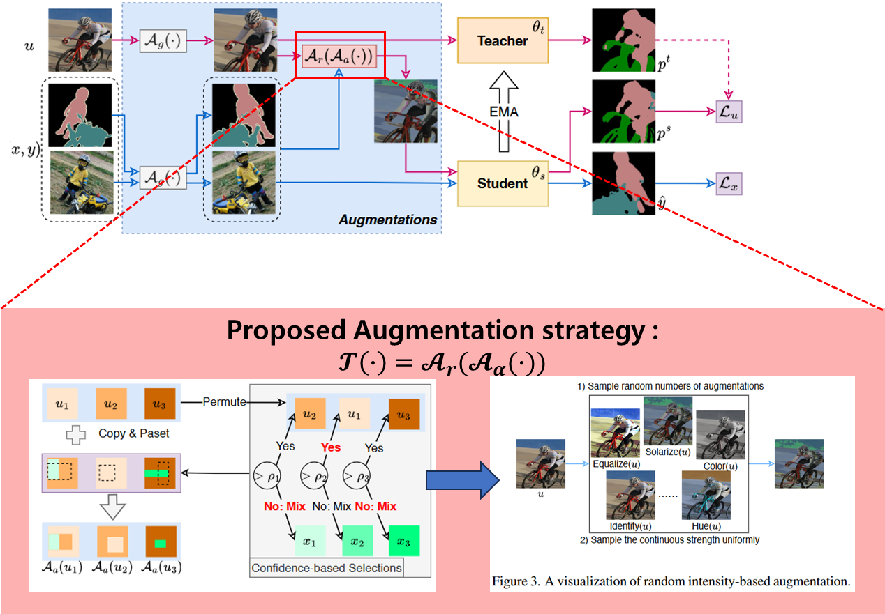

# Dacon_SamsungCapstone
2023 Samsung AI Challenge : Camera-Invariant Domain Adaptation


## Overview
 
> Approach는 [AugSeg (CVPR'23)](https://arxiv.org/abs/2212.04976)과 동일
> Segmentation Model은 [Segformer](https://arxiv.org/abs/2105.15203)를 사용


1. Warm-up Epoch
    - teacher 모델은 student 모델 파라미터를 clone
    - labeled source 데이터만 이용한 CrossEntropy Loss 학습

2. Main Training
    - source (labeled)와 target (unlabeled) 데이터 병렬 학습
    - teacher 모델로 pseudo-label 생성 후, confidence 기반 filtering
    - Adaptive CutMix 적용: target 이미지 일부를 source 이미지와 합성
    - student 모델로 supervised + unsupervised loss 계산
    - EMA 업데이트로 teacher 모델 지속적으로 개선

3. Evaluation
    - validation 데이터로 mean IoU (mIoU) 측정
    - 테스트 이미지에 대해 예측한 마스크를 RLE 인코딩하여 제출 파일 (.csv) 생성


## Environment
```
pip install torchvision==0.8.2
pip install timm==0.3.2
pip install mmcv-full==1.2.7
pip install opencv-python==4.5.1.48
pip install albumentations
pip install transformers
cd SegFormer && pip install -e . --user
```
Other requirements: 

```
pip install wandb 
```

## Run
```
python -u main.py --epoch 100 --resize 512 --lr 0.00006 --batch_size 8 --datadir ./dataset --outdir "./out" --warmup $0 or 1$
``````
if you want to log, use ``--wandb`` flag.